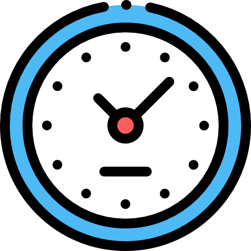

# Relógio TUI - Clone do Relógio do Windows 11



Este é um aplicativo de relógio multifuncional para o terminal (TUI - Textual User Interface), construído em Python com o framework Textual. Ele se inspira nas funcionalidades e no design do aplicativo de Relógio do Windows 11, oferecendo uma experiência rica e totalmente navegável pelo teclado.

## ✨ Funcionalidades

O aplicativo é dividido em cinco abas principais, cada uma com suas próprias ferramentas:

1.  **Relógio Mundial:**
    *   Exibe a hora e data local em grande destaque, atualizadas em tempo real.
    *   Permite adicionar múltiplos "cartões" de fusos horários de cidades ao redor do mundo, selecionáveis através de um menu suspenso.

2.  **Alarmes:**
    *   Crie e gerencie múltiplos alarmes.
    *   Notificação nativa do sistema operacional (Toast no Windows, `notify-send` no Linux) e som contínuo quando um alarme dispara.
    *   Funcionalidade de "Soneca" (+5m, +15m) que adia o alarme sem alterar o horário principal.
    *   Os alarmes permanecem ativos para os dias seguintes.

3.  **Cronômetro:**
    *   Cronômetro de alta precisão.
    *   Funcionalidade de "Volta" (Lap) para registrar tempos parciais.
    *   Suporte para múltiplos cronômetros independentes na mesma tela.

4.  **Temporizador:**
    *   Contagem regressiva com entrada de tempo no formato "micro-ondas" (HH:MM:SS).
    *   Dispara notificação e som de alarme contínuo ao zerar.

5.  **Pomodoro:**
    *   Gerenciador de tempo com a técnica Pomodoro.
    *   Tempos de Foco e Pausa totalmente customizáveis (em minutos).
    *   Opção de "Ciclos automáticos" para iniciar a pausa logo após o fim do foco.
    *   Notificação com som de sinos para uma transição suave entre os períodos.

### Outras Características Notáveis

*   **Persistência de Dados:** Todos os seus alarmes e fusos horários são salvos em um arquivo `dados.json` ao sair, e recarregados automaticamente ao iniciar o app.
*   **Modo de Fundo (Windows):** No Windows, o aplicativo pode ser ocultado na bandeja do sistema (próximo ao relógio), continuando a monitorar alarmes e pomodoros sem a janela do terminal visível.
*   **Navegação por Teclado:** O aplicativo foi projetado para ser 100% controlável pelo teclado, com atalhos para troca de abas (`1`-`5`, Setas), adição/remoção de itens (`n`, `r`) e navegação interna (`Tab`, `Shift+Tab`).
*   **Inicialização com o Sistema (Linux):** Pode ser configurado para iniciar automaticamente com o boot do sistema no Linux.

## 🛠️ Tecnologias Utilizadas

*   **Python 3**
*   **Textual:** Framework principal para a construção da interface TUI.
*   **pystray & Pillow:** Utilizadas para criar e gerenciar o ícone na bandeja do sistema no Windows.
*   **Bibliotecas Nativas do Python:** `json`, `datetime`, `os`, `sys`, `platform`, `subprocess`, `threading`, `zoneinfo`, `ctypes` (Windows), `winsound` (Windows).

## 🚀 Como Rodar

Siga os passos abaixo para executar o aplicativo em seu ambiente de desenvolvimento.

### Pré-requisitos
*   Python 3.8 ou superior.
*   `pip` (gerenciador de pacotes do Python).

### 1. Clone ou Baixe o Projeto

Se estiver usando git:
```bash
git clone <URL_DO_SEU_REPOSITORIO>
cd <NOME_DA_PASTA>
```

### 2. Crie e Ative um Ambiente Virtual

É uma boa prática isolar as dependências do projeto.
```bash
python -m venv venv
```
**No Windows:**
```powershell
.\venv\Scripts\Activate.ps1
```
**No Linux/macOS:**
```bash
source venv/bin/activate
```

### 3. Instale as Dependências

Com o ambiente virtual ativado, instale todos os pacotes necessários:
```bash
pip install textual tzdata pystray pillow
```

### 4. Execute o Aplicativo

Finalmente, rode o script principal:
```bash
python src/main.py
```

## 🐧 Instalação no Linux (Inicialização Automática)

Para que o aplicativo inicie automaticamente toda vez que você ligar seu computador Linux, siga estes passos:

1.  **Mova o projeto para um local permanente.** Por exemplo, para uma pasta `apps` no seu diretório home:
    ```bash
    mv /caminho/do/seu/projeto ~/apps/relogio-tui
    ```

2.  **Execute o comando de setup.** A partir de qualquer lugar no seu terminal, execute o script com a flag `--setup-startup`, usando o caminho absoluto para o arquivo:
    ```bash
    python ~/apps/relogio-tui/src/main.py --setup-startup
    ```

Isso criará um arquivo de configuração em `~/.config/autostart/`, garantindo que o aplicativo seja iniciado (e minimizado, se for o caso) no próximo login.

## 📂 Estrutura do Projeto

O código é modularizado para facilitar a manutenção:

```
/
├── src/
│   ├── main.py             # Ponto de entrada principal, CSS e lógica de navegação
│   ├── alarme.py           # Lógica do widget de Alarme
│   ├── cronometro.py       # Lógica do widget de Cronômetro
│   ├── pomodoro.py         # Lógica do widget de Pomodoro
│   ├── relogio_mundial.py  # Lógica do widget de Relógio Mundial
│   └── temporizador.py     # Lógica do widget de Temporizador
├── dados.json              # Arquivo de persistência de dados (criado automaticamente)
├── icone.ico               # Ícone para Windows
└── icone.png               # Ícone para Linux e bandeja do sistema
```